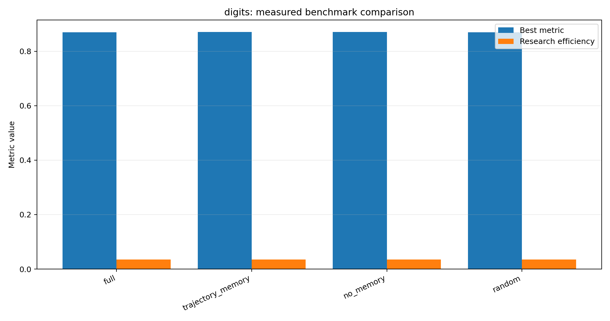
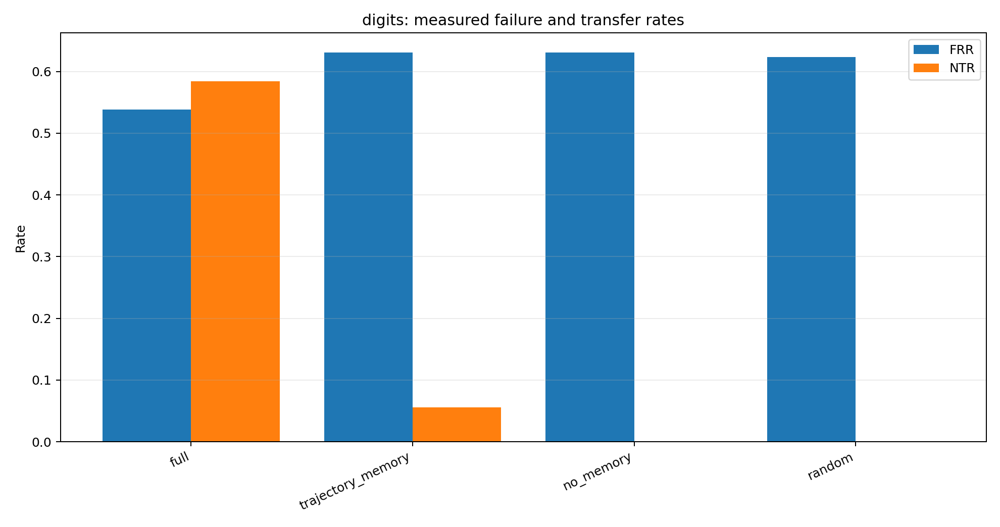
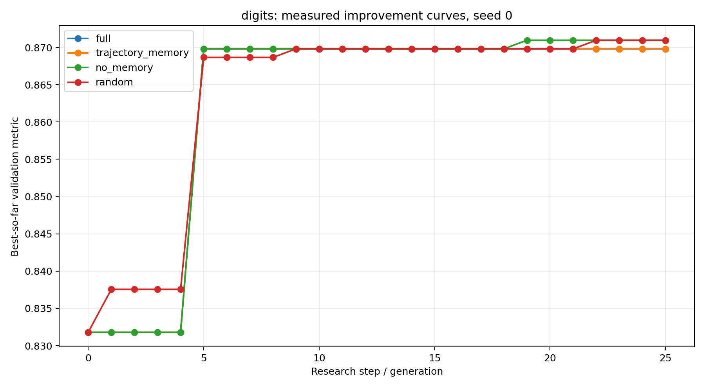
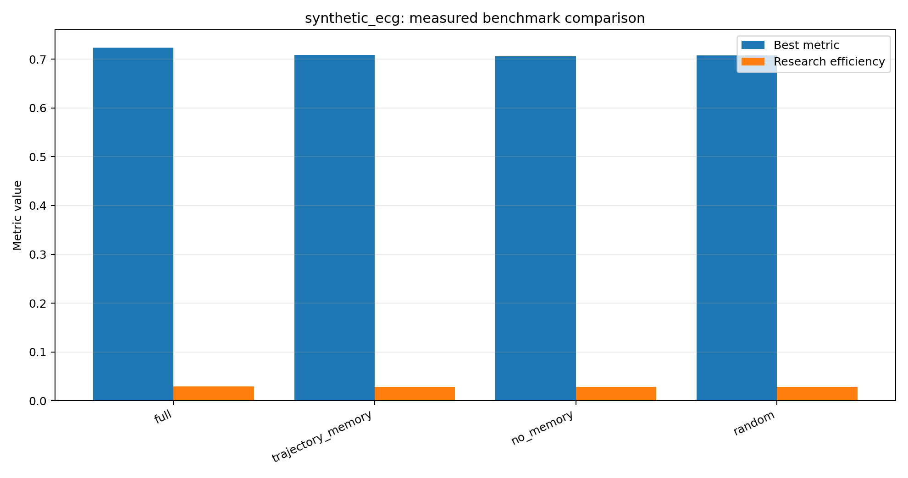
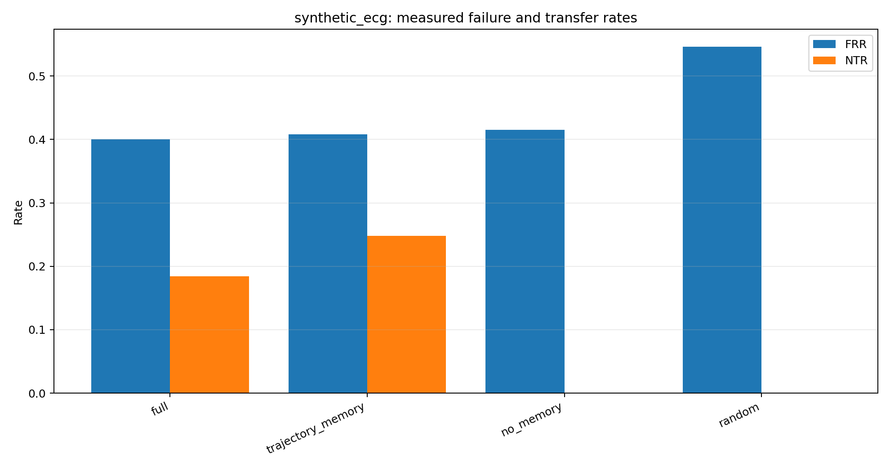
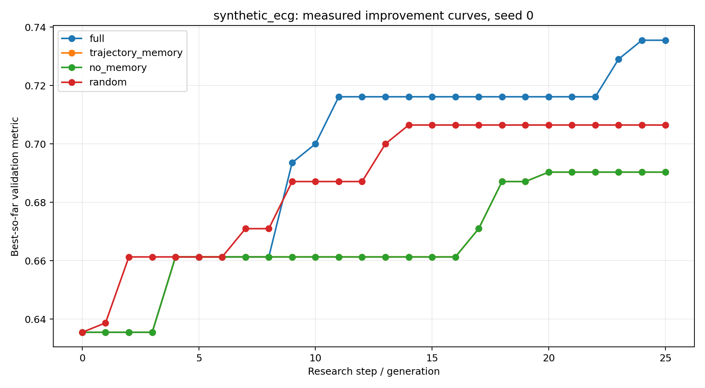
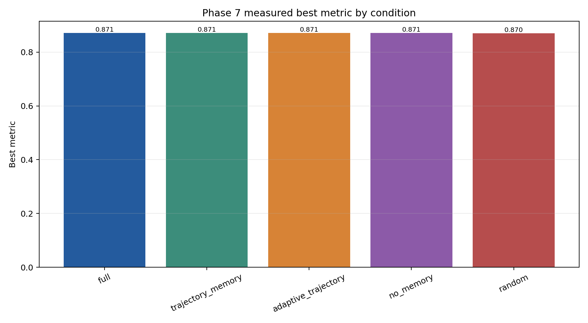
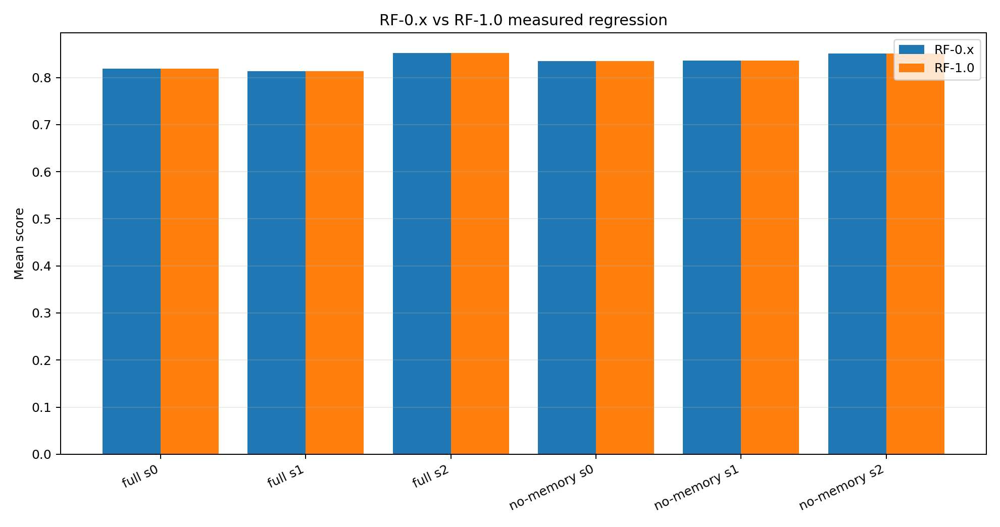

# Overall Model Evolution and Results

> Evidence-backed report generated from repository artifacts. Percentages are measured rates converted to percent; `N/A` means the required confirmatory evidence does not exist yet.

## Evidence Status
| Evidence stream | Status | Source | Interpretation |
|---|---|---|---|
| RF-0.x baseline | EXECUTED | Research_model/rf1_benchmark_report_v2.json | Historical baseline and provenance comparison |
| Phase 6 | EXECUTED | phase6_benchmark_result.json | Graph/reconstruction microbenchmark |
| Phase 7 | EXECUTED | phase7_benchmark_result.json | Digits adaptive-memory benchmark |
| RDE-Bench | EXECUTED | demo_results.json | Five-seed, 25-generation measured ablations |
| Phase 11 | ARTIFACT PRESENT; RAW OBSERVATIONS EMPTY | phase11_continuity_benchmark_result.json | Do not treat as efficacy evidence |
| Phase 12A | METHOD VALIDATION | phase12_statistical_validation.json | Statistical engine/protocol validation; not a new efficacy run |
| Phase 12B | FROZEN / NOT EXECUTED | phase12b_cohort_specification.json | 32,400 planned trials; raw freeze pending |
| RF-FLEX pilot | DESCRIPTIVE ONLY | Phase 13.8 pilot artifacts | Integration and lineage coverage, not efficacy |
| RF-FLEX confirmatory | LOCKED / NOT EXECUTED | Phase 13.9-13.11 protocol and gate | No superiority claim permitted |

## Overall Evolution
| Stage | Implemented/evaluated capability | Evidence status |
|---|---|---|
| RF-0.x | Baseline research loop, memory, model evolution | Historical executed results |
| RF-1.0 alpha | Typed domain objects, RSG/TMG, provenance, regression preservation | IMPLEMENTED and regression-tested |
| Phase 11 | Continuity and cross-task transfer protocol | Protocol artifact present; raw observations empty |
| Phase 12A/12B | SAP, cohort, execution ledger, preflight and raw-freeze infrastructure | Method/infrastructure verified; confirmatory results unavailable |
| Phase 13.7-13.8 | RF-FLEX integration, reconstruction, router and guard telemetry | Pilot PASS, descriptive only |
| Phase 13.9-13.11 | Frozen design, calibration, exact-commit execution gate and release seal | Design/gate verified; authorization remains false |

## Measured RDE-Bench Comparisons
`best_metric` and `research_efficiency` are reported as raw values. FRR/NTR are percentages. `Delta vs no_memory` is a percentage-point difference in best metric, not a causal effect.

| Task | Condition | Best | Best std | RE | SE | FRR | NTR | Delta vs no_memory |
|---|---|---|---|---|---|---|---|---|
| digits | full | 0.8700 | 0.0011 | 0.0348 | 25 | 53.85% | 58.40% | -0.05 pp |
| digits | trajectory_memory | 0.8707 | 0.0013 | 0.0348 | 25 | 63.08% | 5.60% | +0.02 pp |
| digits | no_memory | 0.8705 | 0.0012 | 0.0348 | 25 | 63.08% | 0.00% | +0.00 pp |
| digits | random | 0.8698 | 0.0029 | 0.0348 | 25 | 62.31% | 0.00% | -0.07 pp |
| synthetic_ecg | full | 0.7239 | 0.0072 | 0.0290 | 25 | 40.00% | 18.40% | +1.74 pp |
| synthetic_ecg | trajectory_memory | 0.7084 | 0.0113 | 0.0283 | 25 | 40.77% | 24.80% | +0.19 pp |
| synthetic_ecg | no_memory | 0.7065 | 0.0119 | 0.0283 | 25 | 41.54% | 0.00% | +0.00 pp |
| synthetic_ecg | random | 0.7077 | 0.0159 | 0.0283 | 25 | 54.62% | 0.00% | +0.13 pp |

## Phase 7 Adaptive-Memory Comparison
| Condition | Best | RE | SE | FRR | NTR | Backoff | Memory-influenced decisions |
|---|---|---|---|---|---|---|---|
| full | 0.8710 | 0.0871 | 10 | 13.64% | 25.00% | 0.00% | 0 |
| trajectory_memory | 0.8710 | 0.0871 | 10 | 27.27% | 0.00% | 0.00% | 0 |
| adaptive_trajectory | 0.8710 | 0.0871 | 10 | 27.27% | 0.00% | 100.00% | 20 |
| no_memory | 0.8710 | 0.0871 | 10 | 27.27% | 0.00% | 0.00% | 0 |
| random | 0.8698 | 0.0870 | 10 | 27.27% | 0.00% | 0.00% | 0 |

## RF-0.x vs RF-1.0 Regression
| Regression property | Measured result |
|---|---|
| Comparisons | 6 |
| Mean absolute delta | 0.00000000 |
| Max absolute delta | 0.00000000 |
| Identical trajectories | True |
| Verdict | NO_REGRESSION |

## Engineering and Provenance Results
| Measure | Result | Source |
|---|---|---|
| Phase 6 events / nodes / edges | 43 / 45 / 43 | phase6_benchmark_result.json |
| Phase 6 consistency | True | phase6_benchmark_result.json |
| Phase 12B planned trials | 32400 | phase12b_cohort_specification.json |
| Phase 12B cohort sealed | True | phase12b_cohort_specification.json |
| Phase 12A H1 decision | FAIL_TO_REJECT | phase12_statistical_validation.json |
| Phase 12A validation status | METHOD_VALIDATION | phase12_statistical_validation.json |
| Current report commit | bd6428fe54f4a283edfd6e6f22cf42f600a8531d | git identity at generation |
| Current worktree | DIRTY (unrelated local changes present) | git status at generation |

## RF-FLEX Confirmatory Comparison Matrix
| Condition | Memory | TransferGuard | Router | Scientific result |
|---|---|---|---|---|
| COLD_START | No | No | Fixed | Not executed |
| NO_MEMORY | No | No | Fixed | Not executed |
| TRAJECTORY_MEMORY | Yes | No | Fixed | Not executed |
| ADAPTIVE_TRAJECTORY | Yes | No | Fixed | Not executed |
| TRANSFER_GUARD_STRICT | Yes | Strict | Fixed | Not executed |
| TRANSFER_GUARD_SELECTIVE | Yes | Selective | Fixed | Not executed |
| DYNAMIC_ROUTER | Yes | Selective | Dynamic | Not executed |
| FULL_RESEARCHFORGE | Yes | Selective | Dynamic | Not executed |

## RF-FLEX Pilot and Calibration
| Pilot measure | Value | Status |
|---|---|---|
| Trajectory groups | 9 | Descriptive |
| Lineage records | 36 | Descriptive |
| Transfer decisions | 4 | Descriptive |
| Router transitions | See mode_transitions.jsonl | Descriptive |
| Semantic replay | db1c9164f64b152a4fb972efd622555e13ccc474ee9be98e4295cb5bbf9fe0f3 | Validated |
| Scientific efficacy | NOT ESTABLISHED | Confirmatory execution locked |

## Claim Boundary
The repository demonstrates implemented architecture, engineering verification, measured historical ablations, and RF-FLEX pilot integration. It does not yet demonstrate that TransferGuard, Dynamic Routing, ECRM, or the full ResearchForge architecture improves autonomous research quality. The 720-group confirmatory run remains behind explicit human authorization and has not been executed.

## Generated Artifacts
- `figures/`: measured benchmark comparison, safety-rate, improvement-curve, and regression plots.
- `overall model evolution and results.md`: this report in the requested filename.
- `overall_model_evolution_and_results.md`: machine-friendly alias.
- `ResearchForge-ECRM_Claim_Evidence_Matrix.csv`: claim-to-artifact status matrix.
